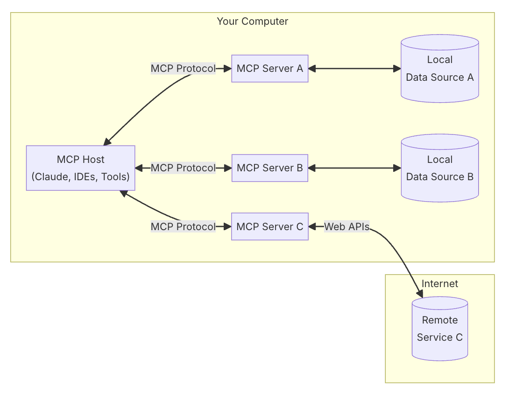
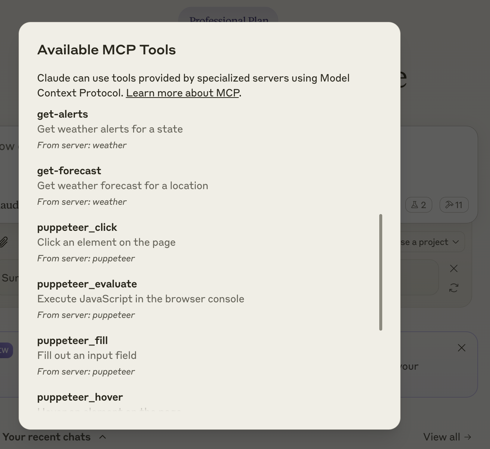
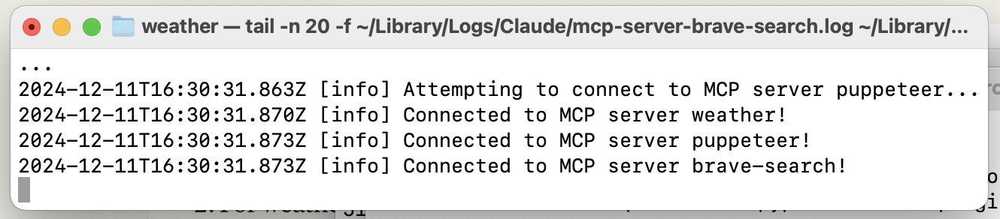

# Learning Claude MCP

Dec 2024
[Steve Chambers](https://viewyonder.com)

Docs and code to learn and explore Claude MCP.

## Introduction

This is a live working set of documents and code to learn and explore Claude MCP. The code is written in Python and uses the Claude MCP library.

I did this work while also learning Zed as my new IDE. Zed is also configured with Claude Sonnet as the AI assistant (inline and chat).

## Table of Contents

- [Using Zed and Claude AI Assistant](#using-zed-and-claude-ai-assistant).
- [Useful resources](#useful-resources).
- [Building a CLI Host App with Claude MCP](#building-a-cli-host-app-with-claude-mcp).

## Using Zed and Claude AI Assistant

Ok, so this is not specific to Claude MCP -- though there is an MCP Protocol piece -- but I'm learning Zed at the same time (two birds with one stone, ay? 😜 ).

Call me old fashioned but I read the [Zed Assistant Documentation](https://zed.dev/docs/assistant/assistant) first. It's like a pre-warm routine for my brain... Here's the main things I'm doing with Zed and AI, with links to offical Zed docs if you need more juice...

1. [Assistant (chat) panel](#assistant-chat-panel).
2. [Inline assistant](#inline-assistant).
3. [Configure the AI assistant](#configure-the-ai-assistant).
4. [Using previous contexts](#using-previous-contexts).
5. [Using slash commands](#using-slash-commands).
6. [Using the prompt library](#using-the-prompt-library).
7. [MCP Context Servers](#mcp-context-servers).

### Configure the AI assistant
[Zed Docs -> Configure the AI assistant](https://zed.dev/docs/assistant/configuration).

By default, you are using the [Zed AI](https://zed.dev/blog/zed-ai) Free Plan which is limited to 1000 requests per month. They are adding a usage plan for "power users" -- is that people who code while on a stairmaster? -- the backend LLM is Anthropic Claude (Dec 2024).

```
  "assistant": {
    "default_model": {
      "provider": "zed.dev",
      "model": "claude-3-5-sonnet-latest"
    },
    "version": "2"
  },
```

You can add your own LLM back-end by just adding a different Assistane model and API key to your Zed settings.json configuration.

```
 "assistant": {
    "default_model": {
      "provider": "anthropic",
      "model": "claude-3-5-sonnet-latest"
    },
    "anthropic": {
      "api_key": "sk-ant-0000000000000"
    },
    "version": "2"
  },
```

Check what your current config is by running `assistant: show configuration`.

### Assistant chat panel
[Zed Docs -> Assistant (chat) panel](https://zed.dev/docs/assistant/assistant-panel).

### Inline assistant
[Zed Docs -> Inline assistant](https://zed.dev/docs/assistant/inline-assistant).

### Using previous contexts
[Zed Docs -> Using previous contexts](https://zed.dev/docs/assistant/contexts).

### Using slash commands
[Zed Docs -> Using slash commands](https://zed.dev/docs/assistant/commands).

### Using the prompt library
[Zed Docs -> Prompt library](https://zed.dev/docs/assistant/prompting).

### MCP Context Servers
[Zed Docs -> MCP Context Servers](https://zed.dev/docs/assistant/context-servers).

## Useful resources

1. [Claude MCP Documentation](https://modelcontextprotocol.io/introduction).
3. [Github -> Model Context Protocol](https://github.com/modelcontextprotocol).
2. [Chris Hay UK](https://x.com/chrishayuk) Youtube [Anthropic MCP with Ollama, No Claude? Watch This!](https://youtu.be/9mciRwpcLNY?si=ZwOcBRSa4qyoIxQy) and Github [MCP-CLI](https://github.com/chrishayuk/mcp-cli).

## Building a CLI Host App with Claude MCP

I'm writing this as I do the work (Dec 2024) so this is going to change as I go.

- [What's the goal?](#whats-the-goal)
- [Why CLI?](#why-cli).
- [What's next?](#whats-next).
- [The plan](#the-plan).

### What's the goal?

I want to build a CLI host app that uses Claude MCP to provide a conversational interface to a set of commands that interact first with local programs and internet services. I'm going to use the Claude MCP Python library to do this.

> The point being that you don't need Claude Desktop (it's your own app) and you can use any backend service and any LLM you want.

### Why CLI?
I like the simplicity of CLI apps. They are fast, easy to use, and can be run on any platform. I also like the idea of building a conversational interface to a set of commands. It's like having a chatbot that can run programs for you.

After the CLI, I will translate this into a web app using something like Flask and Vue.js. I'm also going to explore using Claude MCP to build a web app with a conversational interface.

### What's next?
This is the basis for the next project which is using PydanticAI to create some agents for a use case TBD.

### The plan

I'll break down the key steps from the transcript to help you recreate the Model Context Protocol (MCP) implementation.

1. Basic Setup & Architecture
- The architecture consists of:
  - A host (MCP CLI or Claude desktop)
  - Client applications running within the host -- these are the tools that the user interacts with.
  - MCP servers (like SQLite server in this case)
  - Resources that servers talk to



2. Initial Server Setup
- Use the quick start database from model-context-protocol.io
- Run the MCP SQLite server using: `uvx mcp-server-sqlite test.db`
- The server communicates via standard I/O (though HTTP with server-side events is also possible)

3. Protocol Implementation Steps
   a. Initialize Connection:
   - Send an initialize message (JSON-RPC 2.0)
   - Include client capabilities
   - Receive server capabilities
   - Send initialization notification

   b. Basic Protocol Operations:
   - Implement ping functionality to check server responsiveness
   - Use JSON-RPC 2.0 format for messages
   - Handle read/write streams for communication

4. Core Implementation Components:
- Create base JSON-RPC message structure
- Implement message handlers:
  - Send initialize message
  - Send ping
  - Send tool calls
- Create a system prompt generator
- Convert MCP tools to OpenAI function calling format

5. Chat Mode Implementation:
- Fetch available tools from server
- Generate system prompt with tool definitions
- Initialize LLM client (OpenAI or Ollama)
- Handle conversation history
- Process tool calls:
  - Parse tool call messages
  - Execute tool calls via MCP server
  - Handle responses
  - Update conversation history

6. LLM Integration:
- Support multiple LLM providers (OpenAI, Ollama)
- Ensure the model supports function calling
  - For Ollama, Llama 3.2 or later is recommended
- Convert tool definitions to appropriate function call format for each provider

Key Commands Used:
```bash
# Run the SQLite server
uvx mcp-server-sqlite test.db

# Run the CLI with OpenAI
# Set OPENAI_API_KEY in env file first
uv run main.py

# Run with Ollama
uv run main.py --provider ollama --model llama2
```

The author provided a simplified test implementation in `test.py` that shows the basic protocol implementation without all the complexities of the full CLI.

For Reference:
- GitHub Repository: github.com/cruk/mcp-d-cli
- Base Protocol Documentation: model-context-protocol.io

The key insight is that this implementation essentially uses function calling under the hood, but instead of executing functions locally, it sends them to the MCP server via JSON-RPC messages.

## Working backwards: from server to client.

We'll
- use an internet Weather service as a datasource.
- create a server program that will expose two functions: `get_weather` and `get_forecast`.
- create a client program that will call these functions and display the results.
- use the Claude MCP Python library to communicate between the client and server.

### Add mcp and weather python modules.

```
(.venv) chamberz@Steves-Air claudemcp % uv init
Initialized project `claudemcp`
(.venv) chamberz@Steves-Air claudemcp % uv add mcp httpx
`uv add mcp httpx`
(.venv) chamberz@Steves-Air claudemcp % cat << EOF >> pyproject.toml
[build-system]
requires = [ "hatchling",]
build-backend = "hatchling.build"

[project.scripts]
weather = "weather:main"
EOF
```

In `src/weather/__init__.py`:

```python
from . import server
import asyncio

def main():
    """Main entry point for the package."""
    asyncio.run(server.main())

# Optionally expose other important items at package level
__all__ = ['main', 'server']
```

In `src/weather/server.py`:

```python
from typing import Any
import asyncio
import httpx
from mcp.server.models import InitializationOptions
import mcp.types as types
from mcp.server import NotificationOptions, Server
import mcp.server.stdio

NWS_API_BASE = "https://api.weather.gov"
USER_AGENT = "weather-app/1.0"

server = Server("weather")
```

Now comes the interesting bit where we write the code that exposes functions to the calling client. List tools is an MCP feature that returns our available functions to the client, which are get_alerts and get_forecast in this case.

```python
@server.list_tools()
async def handle_list_tools() -> list[types.Tool]:
    """
    List available tools.
    Each tool specifies its arguments using JSON Schema validation.
    """
    return [
        types.Tool(
            name="get-alerts",
            description="Get weather alerts for a state",
            inputSchema={
                "type": "object",
                "properties": {
                    "state": {
                        "type": "string",
                        "description": "Two-letter state code (e.g. CA, NY)",
                    },
                },
                "required": ["state"],
            },
        ),
        types.Tool(
            name="get-forecast",
            description="Get weather forecast for a location",
            inputSchema={
                "type": "object",
                "properties": {
                    "latitude": {
                        "type": "number",
                        "description": "Latitude of the location",
                    },
                    "longitude": {
                        "type": "number",
                        "description": "Longitude of the location",
                    },
                },
                "required": ["latitude", "longitude"],
            },
        ),
    ]
```

Now we can write the code that calls out to the National Weather Service. The step after this will wire it all together so client calls hit server functions which call this NWS service.

```python
async def make_nws_request(client: httpx.AsyncClient, url: str) -> dict[str, Any] | None:
    """Make a request to the NWS API with proper error handling."""
    headers = {
        "User-Agent": USER_AGENT,
        "Accept": "application/geo+json"
    }

    try:
        response = await client.get(url, headers=headers, timeout=30.0)
        response.raise_for_status()
        return response.json()
    except Exception:
        return None

def format_alert(feature: dict) -> str:
    """Format an alert feature into a concise string."""
    props = feature["properties"]
    return (
        f"Event: {props.get('event', 'Unknown')}\n"
        f"Area: {props.get('areaDesc', 'Unknown')}\n"
        f"Severity: {props.get('severity', 'Unknown')}\n"
        f"Status: {props.get('status', 'Unknown')}\n"
        f"Headline: {props.get('headline', 'No headline')}\n"
        "---"
    )
```

This server call tool is the glue between the calls and functions:

```python
@server.call_tool()
async def handle_call_tool(
    name: str, arguments: dict | None
) -> list[types.TextContent | types.ImageContent | types.EmbeddedResource]:
    """
    Handle tool execution requests.
    Tools can fetch weather data and notify clients of changes.
    """
    if not arguments:
        raise ValueError("Missing arguments")

    if name == "get-alerts":
        state = arguments.get("state")
        if not state:
            raise ValueError("Missing state parameter")

        # Convert state to uppercase to ensure consistent format
        state = state.upper()
        if len(state) != 2:
            raise ValueError("State must be a two-letter code (e.g. CA, NY)")

        async with httpx.AsyncClient() as client:
            alerts_url = f"{NWS_API_BASE}/alerts?area={state}"
            alerts_data = await make_nws_request(client, alerts_url)

            if not alerts_data:
                return [types.TextContent(type="text", text="Failed to retrieve alerts data")]

            features = alerts_data.get("features", [])
            if not features:
                return [types.TextContent(type="text", text=f"No active alerts for {state}")]

            # Format each alert into a concise string
            formatted_alerts = [format_alert(feature) for feature in features[:20]] # only take the first 20 alerts
            alerts_text = f"Active alerts for {state}:\n\n" + "\n".join(formatted_alerts)

            return [
                types.TextContent(
                    type="text",
                    text=alerts_text
                )
            ]
    elif name == "get-forecast":
        try:
            latitude = float(arguments.get("latitude"))
            longitude = float(arguments.get("longitude"))
        except (TypeError, ValueError):
            return [types.TextContent(
                type="text",
                text="Invalid coordinates. Please provide valid numbers for latitude and longitude."
            )]

        # Basic coordinate validation
        if not (-90 <= latitude <= 90) or not (-180 <= longitude <= 180):
            return [types.TextContent(
                type="text",
                text="Invalid coordinates. Latitude must be between -90 and 90, longitude between -180 and 180."
            )]

        async with httpx.AsyncClient() as client:
            # First get the grid point
            lat_str = f"{latitude}"
            lon_str = f"{longitude}"
            points_url = f"{NWS_API_BASE}/points/{lat_str},{lon_str}"
            points_data = await make_nws_request(client, points_url)

            if not points_data:
                return [types.TextContent(type="text", text=f"Failed to retrieve grid point data for coordinates: {latitude}, {longitude}. This location may not be supported by the NWS API (only US locations are supported).")]

            # Extract forecast URL from the response
            properties = points_data.get("properties", {})
            forecast_url = properties.get("forecast")

            if not forecast_url:
                return [types.TextContent(type="text", text="Failed to get forecast URL from grid point data")]

            # Get the forecast
            forecast_data = await make_nws_request(client, forecast_url)

            if not forecast_data:
                return [types.TextContent(type="text", text="Failed to retrieve forecast data")]

            # Format the forecast periods
            periods = forecast_data.get("properties", {}).get("periods", [])
            if not periods:
                return [types.TextContent(type="text", text="No forecast periods available")]

            # Format each period into a concise string
            formatted_forecast = []
            for period in periods:
                forecast_text = (
                    f"{period.get('name', 'Unknown')}:\n"
                    f"Temperature: {period.get('temperature', 'Unknown')}°{period.get('temperatureUnit', 'F')}\n"
                    f"Wind: {period.get('windSpeed', 'Unknown')} {period.get('windDirection', '')}\n"
                    f"{period.get('shortForecast', 'No forecast available')}\n"
                    "---"
                )
                formatted_forecast.append(forecast_text)

            forecast_text = f"Forecast for {latitude}, {longitude}:\n\n" + "\n".join(formatted_forecast)

            return [types.TextContent(
                type="text",
                text=forecast_text
            )]
    else:
        raise ValueError(f"Unknown tool: {name}")
```

And let's not forget the main function to run the server:

```python
async def main():
    # Run the server using stdin/stdout streams
    async with mcp.server.stdio.stdio_server() as (read_stream, write_stream):
        await server.run(
            read_stream,
            write_stream,
            InitializationOptions(
                server_name="weather",
                server_version="0.1.0",
                capabilities=server.get_capabilities(
                    notification_options=NotificationOptions(),
                    experimental_capabilities={},
                ),
            ),
        )

# This is needed if you'd like to connect to a custom client
if __name__ == "__main__":
    asyncio.run(main())
```

Make sure you have this in your pyproject.toml, otherwise you'll get a build error:

```toml
[tool.hatch.build.targets.wheel]
packages = ["src/weather"]
```

Now we can run the server before moving onto writing the client:

`uv run src/weather/server.py`

Now the server is running:

```
(.venv) chamberz@Steves-Air claudemcp % uv run src/weather/server.py
   Built claudemcp @ file:///Users/chamberz/Library/Mobile%20Documents/com~apple~CloudDocs/Code/python/
Installed 1 package in 1ms
```

Before we write our MCP CLI Host/App, let's test it with something we know that works: Claude Desktop.

Firstly, we configure a client in Claude Desktop:

`% zed code ~/Library/Application\ Support/Claude/claude_desktop_config.jsonz

And in there we add a our "weather" server that we created before to the MCP Servers section:

```
{
  "mcpServers": {
    "weather": {
      "command": "uv",
      "args": ["--directory", "src/weather", "run", "weather"]
    },
    "brave-search": {
      "command": "npx",
      "args": ["-y", "@modelcontextprotocol/server-brave-search"],
      "env": {
        "BRAVE_API_KEY": "BSA07Clk9Ma4Kmw3_X03uLFJJEh0uXz"
      }
    },
    "puppeteer": {
      "command": "npx",
      "args": ["-y", "@modelcontextprotocol/server-puppeteer"]
    },
    "sqlite": {
      "command": "uvx",
      "args": [
        "mcp-server-sqlite",
        "--db-path",
        "/Users/chamberz/Code/claudemsp/test.db"
      ]
    }
  },
  "globalShortcut": "Alt+Cmd+C"
}
```

This tells Claude Desktop that there’s an MCP server named “weather”.

Launch it by running `uv --directory src/weather run weather`.

Save the file, and restart Claude for Desktop.

Check the server appears in the Claude Desktop UI:



If the Weather app doesn't show up in your list of servers, then you can check the logs with `tail -n 20 -f ~/Library/Logs/Claude/mcp*.log`

The logs capture:

- Server connection events
- Configuration issues
- Runtime errors
- Message exchanges



You can also prompt just `weather` in Claude Desktop:


So now let's try prompts to try the two National Weather Service functions we created: `get-alerts` and `get-forecast`.

Prompt:
```
fetch the weather at 37.2431° N, 115.7930° W
```

Response:
```
I'll fetch the weather forecast for those coordinates (which are near Rachel, Nevada).View Result from get-forecast from weather (local){
  `latitude`: 37.2431,
  `longitude`: -115.793
}Forecast for 37.2431, -115.793:

Today:
Temperature: 50°F
Wind: 2 mph E
Mostly Sunny
.....etc......
```

Prompt:
```
can you get weather alerts
```

Response
```
I'll check the weather alerts for Nevada (NV).

View Result from get-alerts from weather (local)
There are several active weather alerts for Nevada:

Winter Weather Advisory for the Greater Lake Tahoe Area (active until December 12)
Several Wind Advisories for:
- Lake Havasu
- Fort Mohave
- Lake Mead National Recreation Area
.....etc.....
```
